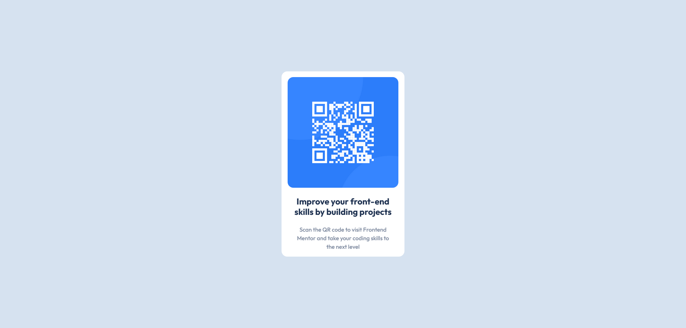

# Frontend Mentor - QR code component solution

This is a solution to the [QR code component challenge on Frontend Mentor](https://www.frontendmentor.io/challenges/qr-code-component-iux_sIO_H). Frontend Mentor challenges help you improve your coding skills by building realistic projects.

## Table of contents

- [Overview](#overview)
  - [The challenge](#the-challenge)
  - [Screenshot](#screenshot)
  - [Links](#links)
- [My process](#my-process)
  - [Built with](#built-with)
  - [What I learned](#what-i-learned)
  - [Continued development](#continued-development)
- [Author](#author)

## Overview

### Screenshot

### Links

- Solution URL: [Solution](https://www.frontendmentor.io/solutions/qr-code-component-CdsTxIFAbA)
- Live Site URL: [Live](https://genuinemiyashita.github.io/QR-Code-Component/)

## My process

The way I tackled this project is by starting with a blank text file and lining out the flow of the work. Since I'm still trying to understand the hierarchy of containers I wrote out this:

-Container A
-Container B
-Image
-Container C
-Text

From there, I wrote out my HTML and incorporated added a reset.css. At that point, I went through the Bootstrap documentation and pretty much played trial and error until I reached the results I wanted.

### Built with

- Mobile-first workflow
- Semantic HTML5 markup
- CSS custom properties
- Bootstrap

### What I learned

I learned a TON about Bootstrap. I went into this project knowing about Bootstrap and having a base understanding of it due to the "The Web Developer Bootcamp 2023" Udemy course that I'm taking. However, I never actually incorporated it into a project. The use of it is probably sloppy and needs to be refined, but I got a bunch of hands on practice with their containers and syntax.

### Continued development

Similar to the previous project, I want to continue development on HTML and CSS, primarily responsive design and using Flexbox and CSS grid together. Last project I said I wanted to start including Bootstrap and I did just that! My next goal is to start expanding on Bootstrap and using the the grid system in unison of containers.

## Author

- Frontend Mentor - [@GenuineMiyashita](https://www.frontendmentor.io/profile/GenuineMiyashita)
